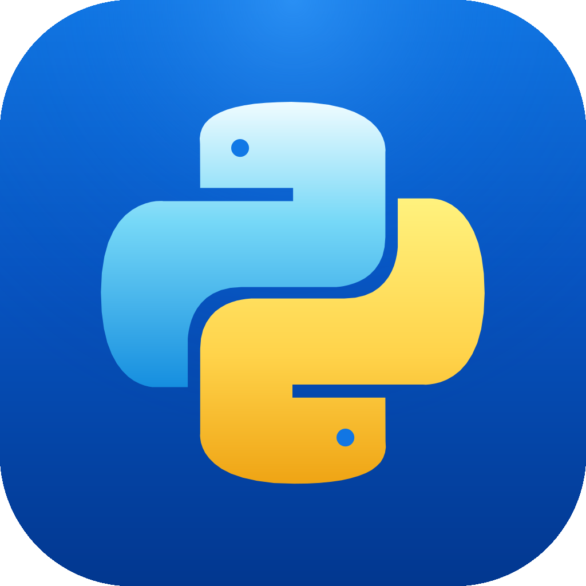

# Python for iOS

CPython 3.14 for developers and terminal users on ARM64, jailbroken iOS.
Includes Python.framework, the standard library, and pip.

## Install

Choose the package matching your jailbreak and install it with your package manager.

| Jailbreak | Package suffix | Install location |
| --- | --- | --- |
| Rootful | `_iphoneos-arm.deb` | `/usr/local` |
| Rootless (iOS 15+) | `_iphoneos-arm64.deb` | `/var/jb/usr/local` |

Rootless builds target the standard `/var/jb` layout. Both packages use the
same package identifier; install only the variant for your jailbreak.

Run `/usr/local/bin/python3` on rootful or `/var/jb/usr/local/bin/python3`
on rootless. Add `-m pip --version` to check pip. Add that `bin` directory
to your `PATH` to use `python3` and `pip` directly.

Packages with native extensions require compatible iOS builds.

## Build

Requires macOS, full Xcode with the iOS SDK, Python 3, and Homebrew.

```sh
brew install dpkg
./scripts/build.sh          # Both packages in dist/
./scripts/build.sh rootless # Rootless only (or use rootful)
```

GitHub Actions builds and verifies both variants and uploads the `.deb` files.
These checks inspect packaging and binaries; runtime testing requires a jailbroken device.

## License

Maintained by k1tty-xz. Build scripts are [MIT licensed](LICENSE); CPython and
bundled dependencies retain their own licenses. Independent of Apple and the
Python Software Foundation.
